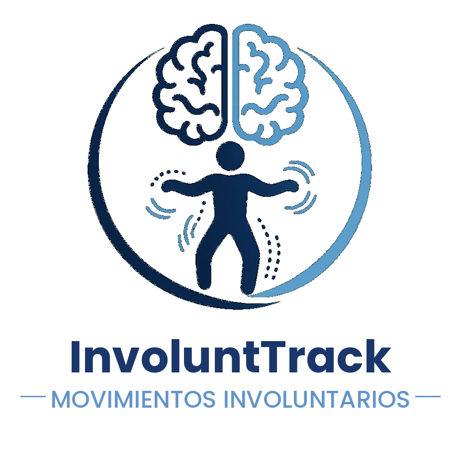

  
  

# Dispositivos de detección de movimientos involuntarios en pacientes con afectaciones motoras

**Autores**: Nicolás José García Gómez, Iván Mamolar Rupérez, Álvar Martínez Bailón y Pablo Santamaría Miguel    
**Asignatura**: Necesidades del paciente    
**Titulación**: Grado en Ingeniería de la Salud  
**Curso académico**: 2025/2026  

---

Las afecciones neuromotoras, como la **parálisis cerebral atetoide**, se caracterizan por la presencia de **movimientos involuntarios** que dificultan tanto el control motor como la determinación de la voluntariedad de los movimientos. 

En este proyecto se proponen dos soluciones tecnológicas orientadas a la identificación y análisis de dichos movimientos:

- En primer lugar, se desarrolla una **aplicación web** denominada **InvoluntTrack**, que evalúa la capacidad del paciente para seguir trayectorias predefinidas mediante el cursor, registrando desviaciones interpretadas como posibles movimientos involuntarios y permitiendo obtener una representación visual y cuantitativa de posibles movimientos involuntarios.

  - Enlace a la aplicación: https://involunttrack.streamlit.app/

- Complementariamente, se ha diseñado un **prototipo de guante sensorizado** basado en microcontroladores y sensores de distancia, fuerza e inclinación, que mide datos relacionados con el movimiento. A partir de la comparación entre patrones normales y patológicos, el sistema permite identificar desviaciones que puedan asociarse con determinadas enfermedades.

Este proyecto sienta las bases para el desarrollo de soluciones innovadoras en el ámbito del apoyo al diagnóstico y monitorización de trastornos motores y neurológicos.

<video 
    src="./Video MovInvoluntarios.mp4" 
    controls 
    width="800"
    muted>
</video>
